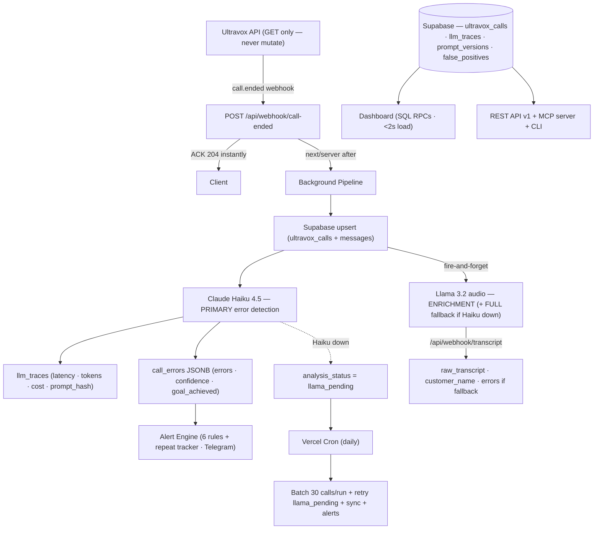

# Voxray — AI Call Intelligence for Voice Agents

> **1,808+ calls analyzed · 52% error rate discovered · 11 agents monitored**  
> Real production data from Uganda business clients (Ramco Gas, Edifice Properties, Davansh Investment)

Voxray detects exact agent mistakes per call, surfaces error patterns, and drives a prompt improvement feedback loop — replacing manual call review with automated AI evaluation.

**Live:** https://voxray.vercel.app

---

## What Voxray Does

```
Call ends on Ultravox
    ↓  webhook fires (<3s)
Claude Haiku analyzes transcript → detects errors with type + severity + quote
    ↓
/dashboard/[agentId] shows:
  - Every error type that agent made (count, trend, confidence)
  - Exact transcript quote showing what the agent said
  - Verified prompt patch: find → replace with confirmed line number
  - Apply Fix button (pre-flight check runs before any write)
    ↓
Operator applies patch → Ultravox prompt updates
    ↓
Voxray re-analyzes recent calls → error rate drops by prompt version
    ↓
Proactive Telegram alert if error regresses after fix
```

---

## Architecture



---

## Dashboard — Agent Profile Flow

`/dashboard` — agent grid (all 11 agents, sorted by call volume, sparklines)

`/dashboard/[agentId]` — per-agent profile:

| Section | What it shows |
|---------|--------------|
| **Stat strip** | Total calls · analyzed · error rate · calls with errors · critical count |
| **Error Intelligence** | Error leaderboard with exact agent quote per type |
| **Verified patches** | Find → replace diff, line number confirmed against live prompt |
| **Apply Fix** | One-click apply (NECTOR Demo + Davansh only; hard allowlist) |
| **Worst calls panel** | 8 most problematic calls with FP marking buttons |
| **Error Heatmap** | 30-day calendar grid per error type — patterns by day |
| **Outcome Chart** | 12-week stacked success/failure breakdown |
| **Before/After** | Date picker → per-error count change after a fix |
| **Prompt version chart** | Error rate per SHA-256 prompt hash |
| **Prompt viewer** | Full system prompt (collapsible) |

`/docs` — full reference page: features, API v1, MCP server, CLI (linked from homepage nav)

`/calls/[id]` — call detail:
- Chat-bubble transcript (collapsible long messages)
- Audio player if recording available
- Error analysis with exact quotes, severity, what should have been said
- Coaching notes from Llama audio enrichment

---

## Fix Lifecycle

1. **Detect** — Haiku flags error, stores `type + severity + confidence + agent_line`
2. **Surface** — Agent profile shows error count + exact quote + verified patch
3. **Verify** — `verifyPatch()` checks find text exists in live prompt → shows line number
4. **Apply** — `POST /api/agents/[agentId]/apply-fix` → pre-flight verify → PATCH Ultravox (manual click, every agent; view-curl preview shown before/after apply)
5. **Prove** — Re-analysis of last 15 calls fires after fix; error rate by prompt version shows drop
6. **Alert** — Repeat error tracker fires Telegram if same error recurs after fix was applied

---

## Key Engineering Decisions

### Multi-Model Pipeline: Haiku Primary, Llama Enrichment + Fallback

Llama 3.2 (self-hosted) consistently missed conditional rule violations that Haiku caught — e.g. `no_save_answers` (only flag if 4+ agent turns AND no Tool message in final 4 messages). Normally Llama runs asynchronously for audio transcription and name extraction only — Haiku is the authoritative error detector.

If Haiku is unavailable (billing, rate limit, network) at analysis time, the call is marked `analysis_status = llama_pending` and Llama becomes the **full** error-detection fallback for that call — it runs full analysis instead of enrichment-only. The daily cron retries all `llama_pending` calls via Llama (never re-attempts Haiku for these).

### False Positive Rate as Ground Truth

Human reviewers mark FPs via the dashboard. The `false_positives` table drives precision per error type. Each error shows a precision badge (🟢 / 🟡 / 🔴). Auto-apply only triggers when FP rate < 5%.

### Prompt Versioning via SHA-256 Hash

Every agent system prompt is SHA-256 hashed at analysis time. After a fix, error rate grouped by prompt hash shows before/after proof in the dashboard.

### Performance: SQL Aggregation over JavaScript

10 Postgres RPC functions push all aggregation to the database. Dashboard loads in under 2 seconds on 1,800+ calls.

### Race-Condition-Safe Analysis

Batch-claim pattern: calls are marked `analyzing` before processing. Parallel terminals can run safely with no double-analysis.

---

## AI Evaluation Framework

| Metric | How computed |
|--------|-------------|
| **Precision** | `(total_flags - fp_count) / total_flags` — from human FP marks |
| **FP Rate** | `fp_count / total_flags × 100` |
| **Confidence** | Haiku rates 0.0–1.0 per error flag |
| **Cost/week** | Total Haiku cost for calls containing this error ÷ weeks of data |

---

## Alerting

**Burst rules (6):** garbled audio burst, location failures, no-save burst, no-save-debt burst, any critical error, wrong cold opening. 4h/24h ack suppression.

**Repeat error tracker:** per-call, 30-day window. Three tiers:
- FIX REGRESSION — fix was applied but error returned
- Apply-now — fix available, not yet applied
- Write-patch — error recurring, no patch yet

All Telegram alerts include inline button → direct agent profile link.

---

## Production Safety

**NEVER POST/PATCH/DELETE to `api.ultravox.ai`.** Live Uganda clients (~100 calls/day). GET only.

Exception: `POST /api/agents/[agentId]/apply-fix` — hard allowlist in `route.ts`. All 11 monitored agents are now in the allowlist (expanded from the original 2 — operator-approved 2026-05-24), apply is **manual-only** (operator clicks Confirm, no auto-apply path exists). Agent IDs not in the allowlist → 403. Pre-flight `verifyPatch()` runs before any PATCH; a `curl` preview of the exact request is shown before and after apply.

---

## API v1

```
GET /api/v1/stats                          Aggregate metrics
GET /api/v1/errors?agent=X&limit=N         Error leaderboard + fix suggestions
GET /api/v1/calls?agent=X&has_errors=true  Call list
GET /api/v1/calls/:id                      Full transcript + analysis
GET /api/v1/export?type=errors|calls       CSV export
```

Auth: `Authorization: Bearer <VOXRAY_API_KEY>`

---

## Stack

| Layer | Technology |
|-------|-----------|
| Framework | Next.js 16 App Router + TypeScript |
| Styling | Tailwind 4 + OKLCH design tokens (dark + light) |
| Database | Supabase (Postgres) |
| AI — Primary | Claude Haiku 4.5 (Anthropic) |
| AI — Enrichment | Llama 3.2 (self-hosted, audio only) |
| Voice Platform | Ultravox (GET only) |
| Alerts | Telegram Bot API |
| Deployment | Vercel (Hobby — daily cron limit) |

---

## Setup

```bash
git clone https://github.com/rushilbh27/voxray
cd voxray && npm install
cp .env.example .env.local   # fill in vars below
npm run dev
```

```env
NEXT_PUBLIC_SUPABASE_URL=
NEXT_PUBLIC_SUPABASE_ANON_KEY=
SUPABASE_SERVICE_ROLE_KEY=
ULTRAVOX_API_KEY=
ANTHROPIC_API_KEY=
VOXRAY_URL=https://voxray.vercel.app
TELEGRAM_BOT_TOKEN=
TELEGRAM_CHAT_ID=
ULTRAVOX_WEBHOOK_SECRET=
VOXRAY_API_KEY=       # optional — API v1 auth
CRON_SECRET=          # optional — cron route auth
```

```bash
npm run sync           # sync latest calls + auto-analyze + alert check
npm run analyze        # batch analyze (Haiku primary, 2 concurrent)
npm run voxray stats   # CLI: aggregate metrics
npm run voxray errors  # CLI: error leaderboard
npm run voxray monitor # CLI: live call monitor
```

---

## Data Model

| Table | Purpose |
|-------|---------|
| `ultravox_calls` | All calls + `call_errors` JSONB + `prompt_hash` + `analysis_status` |
| `ultravox_messages` | Message-level transcripts |
| `llm_traces` | Every Haiku call: latency, tokens, cost, model |
| `prompt_versions` | Prompt hash → first/last seen per agent |
| `false_positives` | Human-labeled FP marks (ground truth for eval) |
| `prompt_fixes` | Fix log: agent, error_type, description, applied_at |
| `alert_acks` | Alert suppression records |

---

## Agents Monitored

All 11 agents below are in the apply-fix allowlist (manual apply enabled for every agent).

| Agent | UUID | Fix-specs |
|-------|------|-----------|
| Sales_AI | `65ae3d7d` | ✅ 11 patches verified |
| Debt-Collector-Agent-UG | `52db715f` | ✅ 7 patches verified |
| Cold_Outreach_AI | `74c435db` | ✅ 8 patches verified |
| NECTOR_DEMO_TEST | `428d7591` | ✅ 4 patches verified |
| Davansh_Investment_inbound | `0a5b5ccc` | ✅ 2 patches verified |
| Edifice_Properties_inbound | `bfea3820` | ✅ 2 patches verified |
| Real_Estate_AI_Sales_Agent | `efecb97c` | ✅ 3 patches verified |
| Ramco_Gas_inbound | `5da7bc3e` | No active errors |
| Debt_Collection_2 | `4be98966` | Same prompt as Debt Collector |
| Follow_Up_Debt_Collection_Bot | `3983f5c0` | No active errors |
| Debt_Collection_Welcome-Bot | `2dfe90c6` | No active errors |
