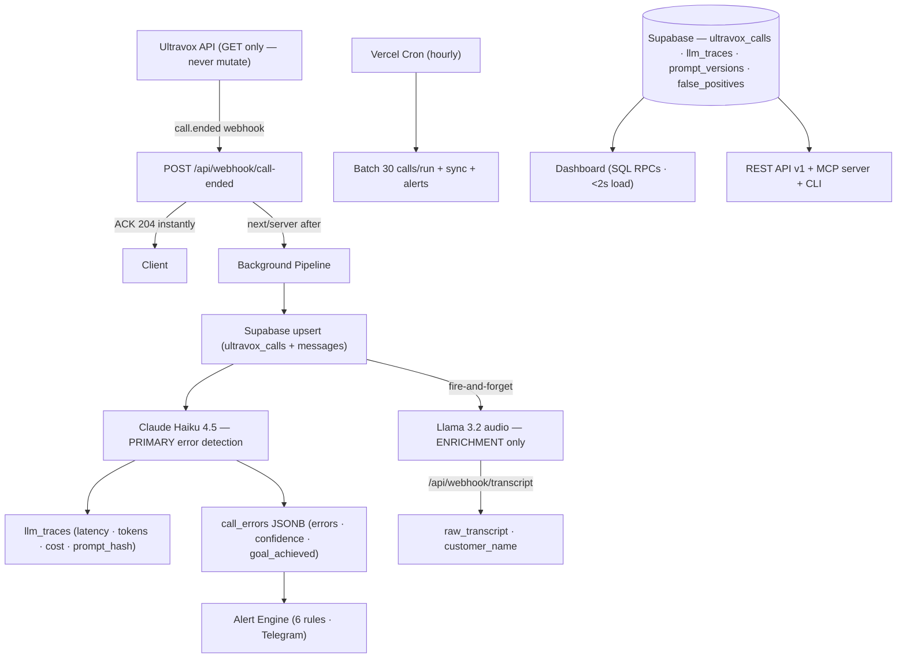

# Voxray — AI Call Intelligence for Voice Agents

> **1,808 calls analyzed · 52% error rate discovered · 11 agents monitored**  
> Real production data from Uganda business clients (Ramco Gas, Edifice Properties, Davansh Investment)

Voxray detects exact agent mistakes per call, surfaces error patterns, and drives a prompt improvement feedback loop — replacing manual call review with automated AI evaluation.

**Live:** https://voxray.vercel.app

---

## Architecture



---

## Key Engineering Decisions

### Multi-Model Pipeline: Haiku Primary, Llama Enrichment-Only

After running both models on the same call set, Llama 3.2 (self-hosted) consistently missed rule violations that Haiku caught — particularly conditional rules like `no_save_answers` (only flag if 4+ agent turns AND no Tool message in final 4 messages). Llama runs asynchronously for audio transcription and name extraction only. Haiku is the authoritative error detector.

### LLM Observability

Every Haiku call writes `input_tokens`, `output_tokens`, `latency_ms`, and `cost_usd` to `llm_traces` fire-and-forget. The dashboard surfaces p50/p95 latency and daily cost, making AI pipeline health visible.

### False Positive Rate as Ground Truth

Human reviewers mark false positives via the dashboard. The `false_positives` table drives precision computation per error type. Each error in the leaderboard shows a precision badge (🟢 solid / 🟡 watch / 🔴 review prompt) — creating accountability for the detection system.

### Prompt Versioning via SHA-256 Hash

Every agent's system prompt is SHA-256 hashed at analysis time and stored per call. When you apply a prompt fix in Ultravox and re-analyze calls, the dashboard shows error rate grouped by prompt hash — proof that fixes work.

### Performance: SQL Aggregation over JavaScript

The original dashboard fetched up to 60,000 rows per page load and aggregated in JavaScript. Eight Postgres RPC functions push all aggregation to the database. Dashboard loads in under 2 seconds.

---

## AI Evaluation Framework

For each of 21 error types:

| Metric | How computed |
|--------|-------------|
| **Precision** | `(total_flags - fp_count) / total_flags` — from human FP marks |
| **FP Rate** | `fp_count / total_flags × 100` |
| **Confidence** | Haiku rates 0.0–1.0 certainty per error flag |
| **Cost/week** | Total call cost for calls containing this error ÷ weeks of data |

`get_eval_stats()` uses `jsonb_array_elements` to unnest `call_errors` JSONB and `LEFT JOIN false_positives` for FP counts — no application-level aggregation.

---

## Real-Time Pipeline

Ultravox fires a `call.ended` webhook within seconds of each call ending:
1. HMAC-SHA256 signature verified
2. 204 ACK sent immediately
3. Next.js `after()` runs in background:
   - Upsert call + messages to Supabase
   - SHA-256 hash agent system prompt → upsert `prompt_versions`
   - Claude Haiku analysis → `llm_traces` + `call_errors` + `prompt_hash`
   - Alert check → Telegram if rules fire

---

## Alerting

6 rules monitored in real-time (garbled audio burst, location failures, no-save burst, no-save-debt burst, any critical error, wrong cold opening). Telegram delivery. 4h / 24h acknowledgment suppresses repeats.

---

## API v1

```
GET /api/v1/stats                          Aggregate metrics
GET /api/v1/errors?agent=X&limit=N         Error leaderboard + fix suggestions
GET /api/v1/calls?agent=X&has_errors=true  Call list
GET /api/v1/calls/:id                      Full transcript + analysis
GET /api/v1/export?type=errors|calls       CSV export
```

Auth: `Authorization: Bearer <VOXRAY_API_KEY>`

---

## Stack

| Layer | Technology |
|-------|-----------|
| Framework | Next.js 16 App Router |
| Language | TypeScript |
| Styling | Tailwind 4 + OKLCH design tokens |
| Database | Supabase (Postgres) |
| AI — Primary | Claude Haiku 4.5 (Anthropic) |
| AI — Enrichment | Llama 3.2 (self-hosted) |
| Voice Platform | Ultravox |
| Alerts | Telegram Bot API |
| Deployment | Vercel |

---

## Setup

```bash
git clone https://github.com/rushilbh27/voxray
cd voxray && npm install
cp .env.example .env.local   # fill in vars below
npm run dev
```

```env
NEXT_PUBLIC_SUPABASE_URL=
NEXT_PUBLIC_SUPABASE_ANON_KEY=
SUPABASE_SERVICE_ROLE_KEY=
ULTRAVOX_API_KEY=
ANTHROPIC_API_KEY=
VOXRAY_URL=https://voxray.vercel.app
TELEGRAM_BOT_TOKEN=
TELEGRAM_CHAT_ID=
ULTRAVOX_WEBHOOK_SECRET=
```

```bash
npm run sync           # sync latest + auto-analyze + alert check
npm run analyze        # batch analyze (5 concurrent, Haiku primary)
npm run voxray stats   # CLI: aggregate metrics
npm run voxray errors  # CLI: error leaderboard
npm run voxray monitor # CLI: live call monitor
```

---

## Data Model

| Table | Purpose |
|-------|---------|
| `ultravox_calls` | All calls + analysis + `prompt_hash` |
| `ultravox_messages` | Message-level transcripts |
| `llm_traces` | Every LLM call: latency, tokens, cost, model |
| `prompt_versions` | Prompt hash → first/last seen per agent |
| `false_positives` | Human-labeled FP marks (ground truth for eval) |
| `prompt_fixes` | Fix log: agent, error_type, date applied |
| `alert_acks` | Alert suppression records |
